# Diagrama de Entidad-Relación: DB-SYSTEM-SIT1

Este es el diagrama de la base de datos `DB-SYSTEM-SIT1.accdb` generado a partir del análisis de las tablas y sus columnas. Puedes visualizar este diagrama utilizando el formato **Mermaid**.

*Si estás en VS Code, puedes instalar la extensión "Mermaid Preview" o "Markdown Preview Mermaid Support" para verlo gráficamente. GitHub y GitLab también renderizan este bloque automáticamente.*

```mermaid
erDiagram
    %% Tablas y sus columnas principales
    AdminPass {
        Int32 Id PK
        String ClaveAdministrador
    }
    
    Areas {
        Int32 IdArea PK
        String Area
        String CentroCosto
    }
    
    AreasAsignadas {
        Int32 IdAreaAsig PK
        String AreaAsig
    }
    
    Aretes {
        Int32 IdArete PK
        String Lote
        String ID
        String Genetica
        String Sexo
        String Estado
    }
    
    Auditorias {
        Int32 IdAuditoria PK
        Int32 FK_IdUsuario FK
        String TablaAfectada
        Int32 IdRegistroAfectado
        String TipoAccion
        DateTime FechaCreacion
        String DetallesCambio
    }
    
    Cargos {
        Int32 IdCargo PK
        String Cargo
        String NombreCortoCargo
    }
    
    Causas {
        Int32 IdCausa PK
        String Causa
        Int32 FK_IdSistema FK
    }
    
    Certificados {
        Int32 IdCertificado PK
        String Correlativo
        DateTime FechaCertificado
        Int32 FK_Usuario FK
        DateTime FechaMuerte
        String IDSemoviente
        String Raza
        String Lote
        String Sexo
        Double Peso
        Int32 FK_EstatusA FK
        Int16 DiasGestacion
        String Nave
        String Seccion
        String Corral
        Int32 FK_Causa FK
        Int32 FK_TipoMuerte FK
        String EvaluaExterna
        String EvaluaInterna
        String Reportado
        DateTime HoraCreacion
        String ImaArete
        String ImaTatuaje
        String ImaCompleta
    }
    
    ConsecutivosPlanillas {
        Int16 FechaPic
        Int32 UltimaPlanilla
    }
    
    CorrelativoCertificado {
        DateTime Fecha
        Int32 UltimoCorrelativo
    }
    
    DetallesPlanilla {
        Int32 IdDetallePlanilla PK
        Int32 idPlanilla FK
        Int16 Linea
        Int32 FK_IdNave FK
        String Codigo
        String Producto
        String UMB
        String Clasificacion
        String Lote
        Double Cantidad
        Double Retorno
        Double Consumo
    }
    
    EstadosR {
        Int32 IdEstado PK
        String Estado
    }
    
    Estatus {
        Int32 IdEstatus PK
        String Estatus
    }
    
    EstatusActual {
        Int32 IdEstatusA PK
        String Siglas
        String EstatusA
    }
    
    EstatusAnimal {
        Int32 IdEstatus PK
        String Estatus
    }
    
    EstatusVacaciones {
        Int32 IdEstatusVacaciones PK
        String Estatus
    }
    
    Galpones {
        Int32 IdGalpon PK
        String Galpon
    }
    
    HorasExtras {
        Int32 IdHorasE PK
        String HorasE
        DateTime Desde
        DateTime Hasta
    }
    
    LotesMaternidad {
        Int32 IdLoteMaternidad PK
        Int16 FechaInicio
        Int16 FechaCierre
        Int32 FK_IdNave FK
        String Lote
        String Area
        Int16 Partos
        Int16 LNV
        Int16 LNM
        Int16 LNMo
        Int16 MPDCierre
        Double Peso
        String EstatusSala
    }
    
    Medicos {
        Int32 IdMedico PK
        Int32 FK_IdPersonal FK
        String ColegioMedicos
        String Estado
        String CodigoMPPS
        String AreaProduccion
        String Unidad
        String Siglas
    }
    
    MunicipiosR {
        Int32 IdMunicipio PK
        Int32 FK_IdEstado FK
        String Municipio
    }
    
    Naves {
        Int32 IdNave PK
        String Nave
        String Granja
    }
    
    ParroquiasR {
        Int32 IdParroquia PK
        Int32 FK_IdMunicipio FK
        String Parroquia
    }
    
    Personal {
        Int32 IdPersonal PK
        String Nombres
        String Apellidos
        String Cedula
        String Telefono
        Int32 FK_IdEstadoR FK
        Int32 FK_IdMunicipioR FK
        Int32 FK_IdParroquiaR FK
        String Ciudad
        String Direccion
        DateTime FechaIngreso
        String NumeroFicha
        Int32 FK_IdTipoNomina FK
        Int32 FK_IdCargo FK
        Int32 FK_IdAreaCC FK
        String CentroCosto
        Int32 FK_IdAreaAsignada FK
        Int32 FK_Turno FK
        Int32 FK_IdEstatusActual FK
        Int32 FK_IdTipoContrato FK
        String Fotografia
    }
    
    Planillas {
        Int32 Idplanilla PK
        Int32 Planilla
        Int16 Pic
        DateTime Fecha
        Int16 Semana
        Int32 IdUsuario FK
        String Traspaso
        String Estado
    }
    
    Productos {
        Int32 IdCodigo PK
        String Codigo
        String Producto
        String UMB
        String Clasificacion
        Double Stock
        Double CantidadMin
    }
    
    Roles {
        Int32 IdRol PK
        String Rol
    }
    
    Secciones {
        Int32 IdSeccion PK
        Int32 FK_Galpon FK
        String Seccion
    }
    
    Sistemas {
        Int32 IdSistema PK
        String Sistema
    }
    
    TipoContrato {
        Int32 IdTipoContrato PK
        String Contrato
    }
    
    TipoNomina {
        Int32 IdTipoNomina PK
        String Nomina
        Int16 Codigo
    }
    
    TiposMuertes {
        Int32 IdTipoMuerte PK
        String TipoMuerte
    }
    
    Turnos {
        Int32 IdTurno PK
        String Turno
        String Jornada
        DateTime H_Entrada
        DateTime H_Salida
        Double TotalHoras
        String HorasDescando
    }
    
    Usuarios {
        Int32 IdUsuario PK
        Int32 FK_IdPersonal FK
        String NombreCorto
        String Usuario
        String Password
        Int32 FK_IdEstatus FK
        DateTime FechaRegistro
        Int32 FK_Rol FK
    }
    
    Vacaciones {
        Int32 IdVacaciones PK
        Int32 FK_IdPersonal FK
        String Periodo
        DateTime Salida
        DateTime Retorno
        Int32 FK_EstatusVacaciones FK
    }

    %% Relaciones / Llaves Foráneas (Inferidas por el nombre de las columnas FK_*)
    Auditorias }o--|| Usuarios : "FK_IdUsuario -> IdUsuario"
    Causas }o--|| Sistemas : "FK_IdSistema -> IdSistema"
    Certificados }o--|| Usuarios : "FK_Usuario -> IdUsuario"
    Certificados }o--|| EstatusActual : "FK_EstatusA -> IdEstatusA"
    Certificados }o--|| Causas : "FK_Causa -> IdCausa"
    Certificados }o--|| TiposMuertes : "FK_TipoMuerte -> IdTipoMuerte"
    DetallesPlanilla }o--|| Planillas : "idPlanilla -> Idplanilla"
    DetallesPlanilla }o--|| Naves : "FK_IdNave -> IdNave"
    LotesMaternidad }o--|| Naves : "FK_IdNave -> IdNave"
    Medicos }o--|| Personal : "FK_IdPersonal -> IdPersonal"
    MunicipiosR }o--|| EstadosR : "FK_IdEstado -> IdEstado"
    ParroquiasR }o--|| MunicipiosR : "FK_IdMunicipio -> IdMunicipio"
    
    Personal }o--|| EstadosR : "FK_IdEstadoR -> IdEstado"
    Personal }o--|| MunicipiosR : "FK_IdMunicipioR -> IdMunicipio"
    Personal }o--|| ParroquiasR : "FK_IdParroquiaR -> IdParroquia"
    Personal }o--|| TipoNomina : "FK_IdTipoNomina -> IdTipoNomina"
    Personal }o--|| Cargos : "FK_IdCargo -> IdCargo"
    Personal }o--|| Areas : "FK_IdAreaCC -> IdArea"
    Personal }o--|| AreasAsignadas : "FK_IdAreaAsignada -> IdAreaAsig"
    Personal }o--|| Turnos : "FK_Turno -> IdTurno"
    Personal }o--|| EstatusActual : "FK_IdEstatusActual -> IdEstatusA"
    Personal }o--|| TipoContrato : "FK_IdTipoContrato -> IdTipoContrato"
    
    Planillas }o--|| Usuarios : "IdUsuario -> IdUsuario"
    Secciones }o--|| Galpones : "FK_Galpon -> IdGalpon"
    
    Usuarios }o--|| Personal : "FK_IdPersonal -> IdPersonal"
    Usuarios }o--|| Estatus : "FK_IdEstatus -> IdEstatus"
    Usuarios }o--|| Roles : "FK_Rol -> IdRol"
    
    Vacaciones }o--|| Personal : "FK_IdPersonal -> IdPersonal"
    Vacaciones }o--|| EstatusVacaciones : "FK_EstatusVacaciones -> IdEstatusVacaciones"
```

