# 📐 Diagrama Normalizado Optimizado: DB-SYSTEM-SIT1

> **Base:** 3NF (Tercera Forma Normal) + mejoras de integridad referencial y convención de nombres snake_case.

---

## 🔍 Problemas detectados en la BD original y sus correcciones

| # | Problema | Tabla(s) | Corrección Aplicada |
|---|---|---|---|
| 1 | **Tablas de estatus duplicadas** sin propósito diferenciado | `Estatus`, `EstatusActual`, `EstatusAnimal`, `EstatusVacaciones` | Unificadas en una sola tabla `statuses` con columna `tipo` (ENUM) |
| 2 | **Columnas desnormalizadas** en `Certificados`: `Nave`, `Seccion`, `Corral` son strings en lugar de FK | `Certificados` | Se reemplazaron por FK → `naves`, `secciones` |
| 3 | **Columnas desnormalizadas** en `LotesMaternidad`: `Area` es un string libre | `LotesMaternidad` | Añadida FK → `areas` |
| 4 | **Columnas desnormalizadas** en `DetallesPlanilla`: `Codigo`, `Producto`, `UMB`, `Clasificacion` y `Lote` duplican datos de `Productos` | `DetallesPlanilla` | Solo se guarda `producto_id` FK → `products` |
| 5 | **`Personal.CentroCosto`** desnormalizado (dato ya en `Areas`) | `Personal` | Eliminada la columna redundante |
| 6 | **`Areas` y `AreasAsignadas`** son conceptos distintos pero similares en estructura | `Areas`, `AreasAsignadas` | Unificadas en `areas` con columna `tipo` para distinguirlas |
| 7 | **`AdminPass`** tabla de contraseña suelta sin relación a usuarios | `AdminPass` | Eliminada; la contraseña admin debe IR en `users` con un rol ADMIN |
| 8 | **`CorrelativoCertificado` y `ConsecutivosPlanillas`** no tienen PK | ambas | Añadida PK `id` autoincremental |
| 9 | **`Aretes`** referencia `Lote` y `Estado` como strings | `Aretes` | Añadida FK → `lotes_maternidad` y → `statuses` |
| 10 | **Convención de nombres inconsistente** (PascalCase, mezcla español/inglés, `FK_` prefijos) | Todas | Estandarizado a `snake_case` en español |
| 11 | **`HorasExtras`** no tiene relación a `Personal` | `HorasExtras` | Añadida FK → `personal` |
| 12 | **`Vacaciones`** no tiene relación con `HorasExtras` (ambas son ausencias/tiempo) | ambas | Agrupadas bajo módulo de RRHH con FK clara |
| 13 | **`Secciones` → `Galpones`** pero `Naves` no pertenece a ningún galpón | `Naves`, `Galpones`, `Secciones` | Añadida FK `galpon_id` a `naves` |
| 14 | **`Planillas`** no tiene FK hacia `Naves` (solo en `DetallesPlanilla`) | `Planillas` | Se mantiene el diseño maestro-detalle pero se corrige la FK |
| 15 | **`Medicos.Estado`** es un string libre | `Medicos` | Referenciado contra `statuses` |

---

## 📊 Diagrama ERD Normalizado

```mermaid
erDiagram

    %% ==============================
    %% MÓDULO: INFRAESTRUCTURA / UBICACIÓN
    %% ==============================

    galpones {
        int id PK
        varchar nombre
        timestamp created_at
        timestamp updated_at
    }

    naves {
        int id PK
        int galpon_id FK
        varchar nombre
        varchar granja
        timestamp created_at
        timestamp updated_at
    }

    secciones {
        int id PK
        int nave_id FK
        varchar nombre
        timestamp created_at
        timestamp updated_at
    }

    %% ==============================
    %% MÓDULO: CATÁLOGOS / LOOKUP TABLES
    %% ==============================

    statuses {
        int id PK
        varchar tipo
        varchar codigo
        varchar descripcion
        timestamp created_at
    }

    %% tipo: 'usuario','animal','vacaciones','empleado','planilla','sala_maternidad'

    roles {
        int id PK
        varchar nombre
        timestamp created_at
        timestamp updated_at
    }

    cargos {
        int id PK
        varchar nombre
        varchar nombre_corto
        timestamp created_at
        timestamp updated_at
    }

    tipos_contrato {
        int id PK
        varchar nombre
        timestamp created_at
        timestamp updated_at
    }

    tipos_nomina {
        int id PK
        varchar nombre
        int codigo
        timestamp created_at
        timestamp updated_at
    }

    turnos {
        int id PK
        varchar nombre
        varchar jornada
        time hora_entrada
        time hora_salida
        decimal total_horas
        varchar horas_descanso
        timestamp created_at
        timestamp updated_at
    }

    tipos_muerte {
        int id PK
        varchar nombre
        timestamp created_at
        timestamp updated_at
    }

    sistemas {
        int id PK
        varchar nombre
        timestamp created_at
        timestamp updated_at
    }

    causas {
        int id PK
        int sistema_id FK
        varchar descripcion
        timestamp created_at
        timestamp updated_at
    }

    %% ==============================
    %% MÓDULO: GEOGRAFÍA (Venezuela)
    %% ==============================

    estados {
        int id PK
        varchar nombre
        timestamp created_at
    }

    municipios {
        int id PK
        int estado_id FK
        varchar nombre
        timestamp created_at
    }

    parroquias {
        int id PK
        int municipio_id FK
        varchar nombre
        timestamp created_at
    }

    %% ==============================
    %% MÓDULO: ÁREAS
    %% ==============================

    areas {
        int id PK
        varchar nombre
        varchar tipo
        varchar centro_costo
        timestamp created_at
        timestamp updated_at
    }

    %% tipo: 'centro_costo' (antes Areas) o 'asignada' (antes AreasAsignadas)

    %% ==============================
    %% MÓDULO: PERSONAL / RRHH
    %% ==============================

    personal {
        int id PK
        varchar nombres
        varchar apellidos
        varchar cedula
        varchar telefono
        int estado_id FK
        int municipio_id FK
        int parroquia_id FK
        varchar ciudad
        varchar direccion
        date fecha_ingreso
        varchar numero_ficha
        int tipo_nomina_id FK
        int cargo_id FK
        int area_cc_id FK
        int area_asignada_id FK
        int turno_id FK
        int status_id FK
        int tipo_contrato_id FK
        varchar fotografia
        timestamp created_at
        timestamp updated_at
    }

    medicos {
        int id PK
        int personal_id FK
        varchar colegio_medicos
        varchar codigo_mpps
        varchar area_produccion
        varchar unidad
        varchar siglas
        int status_id FK
        timestamp created_at
        timestamp updated_at
    }

    vacaciones {
        int id PK
        int personal_id FK
        varchar periodo
        date fecha_salida
        date fecha_retorno
        int status_id FK
        timestamp created_at
        timestamp updated_at
    }

    horas_extras {
        int id PK
        int personal_id FK
        varchar descripcion
        datetime desde
        datetime hasta
        timestamp created_at
        timestamp updated_at
    }

    %% ==============================
    %% MÓDULO: USUARIOS / ACCESO
    %% ==============================

    users {
        int id PK
        int personal_id FK
        varchar nombre_corto
        varchar usuario
        varchar password_hash
        int status_id FK
        int rol_id FK
        timestamp created_at
        timestamp updated_at
    }

    auditorias {
        int id PK
        int user_id FK
        varchar tabla_afectada
        int id_registro_afectado
        varchar tipo_accion
        text detalles_cambio
        timestamp created_at
    }

    %% ==============================
    %% MÓDULO: PRODUCCIÓN ANIMAL
    %% ==============================

    aretes {
        int id PK
        int lote_maternidad_id FK
        varchar id_semoviente
        varchar genetica
        varchar sexo
        int status_id FK
        timestamp created_at
        timestamp updated_at
    }

    lotes_maternidad {
        int id PK
        int nave_id FK
        int area_id FK
        varchar nombre_lote
        date fecha_inicio
        date fecha_cierre
        int partos
        int lnv
        int lnm
        int lnmo
        int mpd_cierre
        decimal peso_promedio
        int status_id FK
        timestamp created_at
        timestamp updated_at
    }

    certificados {
        int id PK
        varchar correlativo
        int user_id FK
        int arete_id FK
        int nave_id FK
        int seccion_id FK
        varchar corral
        int causa_id FK
        int tipo_muerte_id FK
        int status_id FK
        decimal peso
        int dias_gestacion
        varchar evalua_externa
        varchar evalua_interna
        varchar reportado
        varchar ima_arete
        varchar ima_tatuaje
        varchar ima_completa
        datetime fecha_muerte
        timestamp created_at
        timestamp updated_at
    }

    correlativos_certificados {
        int id PK
        date fecha
        int ultimo_correlativo
        timestamp created_at
    }

    %% ==============================
    %% MÓDULO: PLANILLAS / INVENTARIO
    %% ==============================

    productos {
        int id PK
        varchar codigo
        varchar nombre
        varchar unidad_medida
        varchar clasificacion
        decimal stock
        decimal cantidad_minima
        timestamp created_at
        timestamp updated_at
    }

    planillas {
        int id PK
        int numero_planilla
        int pic
        date fecha
        int semana
        int user_id FK
        varchar traspaso
        int status_id FK
        timestamp created_at
        timestamp updated_at
    }

    consecutivos_planillas {
        int id PK
        int fecha_pic
        int ultima_planilla
        timestamp created_at
    }

    detalles_planilla {
        int id PK
        int planilla_id FK
        int nave_id FK
        int producto_id FK
        int linea
        varchar lote_producto
        decimal cantidad
        decimal retorno
        decimal consumo
        timestamp created_at
        timestamp updated_at
    }

    %% ==============================
    %% RELACIONES
    %% ==============================

    %% Infraestructura
    galpones ||--o{ naves : "tiene"
    naves ||--o{ secciones : "tiene"
    naves ||--o{ lotes_maternidad : "aloja"
    naves ||--o{ detalles_planilla : "consume en"

    %% Catálogos
    sistemas ||--o{ causas : "agrupa"

    %% Geografía
    estados ||--o{ municipios : "contiene"
    municipios ||--o{ parroquias : "contiene"

    %% Personal y RRHH
    personal }o--|| estados : "reside en"
    personal }o--|| municipios : "reside en"
    personal }o--|| parroquias : "reside en"
    personal }o--|| tipos_nomina : "tiene"
    personal }o--|| cargos : "ocupa"
    personal }o--|| areas : "CC en"
    personal }o--|| areas : "asignado a"
    personal }o--|| turnos : "tiene"
    personal }o--|| statuses : "tiene estado"
    personal }o--|| tipos_contrato : "tiene"
    personal ||--o{ vacaciones : "solicita"
    personal ||--o{ horas_extras : "registra"
    personal ||--o| medicos : "puede ser"

    %% Usuarios
    users }o--|| personal : "es"
    users }o--|| statuses : "tiene estado"
    users }o--|| roles : "tiene"
    users ||--o{ auditorias : "genera"
    users ||--o{ planillas : "crea"
    users ||--o{ certificados : "emite"

    %% Producción Animal
    aretes }o--|| lotes_maternidad : "pertenece a"
    aretes }o--|| statuses : "tiene estado"
    lotes_maternidad }o--|| areas : "asignado a"
    lotes_maternidad }o--|| statuses : "tiene estado"
    certificados }o--|| aretes : "certifica"
    certificados }o--|| naves : "ubicado en"
    certificados }o--|| secciones : "en sección"
    certificados }o--|| causas : "causa de muerte"
    certificados }o--|| tipos_muerte : "tipo de muerte"
    certificados }o--|| statuses : "tiene estado"

    %% Planillas / Inventario
    detalles_planilla }o--|| planillas : "pertenece a"
    detalles_planilla }o--|| productos : "referencia"
    planillas }o--|| statuses : "tiene estado"
    medicos }o--|| statuses : "tiene estado"
    vacaciones }o--|| statuses : "tiene estado"
    causas }o--|| sistemas : "pertenece a"
```

---

## 📋 Resumen de cambios estructurales

### 🔴 Tablas ELIMINADAS (fusionadas o removidas)
| Tabla original | Razón |
|---|---|
| `AdminPass` | Eliminada — la contraseña admin va en `users` con rol ADMIN |
| `Estatus` | Fusionada en `statuses` con campo `tipo` |
| `EstatusActual` | Fusionada en `statuses` con tipo='empleado' |
| `EstatusAnimal` | Fusionada en `statuses` con tipo='animal' |
| `EstatusVacaciones` | Fusionada en `statuses` con tipo='vacaciones' |
| `AreasAsignadas` | Fusionada en `areas` con campo `tipo='asignada'` |
| `MunicipiosR` | Renombrada a `municipios` (sin sufijo R) |
| `EstadosR` | Renombrada a `estados` (sin sufijo R) |
| `ParroquiasR` | Renombrada a `parroquias` (sin sufijo R) |
| `Usuarios` | Renombrada a `users` |

### 🟡 Tablas MODIFICADAS
| Tabla original | Tabla nueva | Cambio principal |
|---|---|---|
| `Personal` | `personal` | Sin `CentroCosto` (redundante), FK corregidas |
| `Certificados` | `certificados` | `Nave`, `Seccion`, `Corral` → FK; `IDSemoviente`, `Raza`, `Lote`, `Sexo` → a través de FK a `aretes` |
| `DetallesPlanilla` | `detalles_planilla` | `Codigo`, `Producto`, `UMB`, `Clasificacion` → FK a `productos` |
| `LotesMaternidad` | `lotes_maternidad` | `Area` (string) → FK a `areas` |
| `Naves` | `naves` | Añadida FK a `galpones` |
| `Aretes` | `aretes` | `Lote` (string) → FK a `lotes_maternidad`, `Estado` → FK a `statuses` |
| `HorasExtras` | `horas_extras` | Añadida FK a `personal` |
| `Medicos` | `medicos` | `Estado` → FK a `statuses` |
| `CorrelativoCertificado` | `correlativos_certificados` | Añadida PK `id` |
| `ConsecutivosPlanillas` | `consecutivos_planillas` | Añadida PK `id` |

### 🟢 Tablas NUEVAS creadas
| Tabla | Razón |
|---|---|
| `statuses` | Unifica todas las tablas de estatus con campo `tipo` |
| *(ninguna otra)* | El resto son fusiones o renombrados |

---

## 🗂️ Convención de nombres aplicada

| Antes | Ahora |
|---|---|
| `PascalCase` | `snake_case` |
| Prefijos `FK_`, `Id` | Columnas limpias: `personal_id`, `rol_id` |
| Sufijo `R` en tablas geográficas | Eliminado |
| Nombres en español inconsistentes | Español limpio y consistente |
| PKs: `IdPersonal`, `IdUsuario` | PKs: `id` (estándar) |

---

## 🔒 Mejoras de integridad y seguridad

- ✅ `users.password` → renombrado a `password_hash` (refuerza que NUNCA se guarde en texto plano)
- ✅ Todas las tablas tienen `created_at` y `updated_at`
- ✅ Tablas de auditoría conectadas a usuarios reales
- ✅ Todas las PKs son `int id` estándar (autoincremental)
- ✅ Eliminada `AdminPass` como tabla separada (anti-patrón de seguridad)

---

## 📦 Tabla de conteo

| Concepto | Antes | Después |
|---|---|---|
| Total de tablas | 34 | **26** |
| Tablas de estatus duplicadas | 4 | 1 (`statuses`) |
| Tablas geográficas | 3 | 3 (renombradas) |
| Columnas string en lugar de FK | 8+ | 0 |
| Tablas sin PK | 2 | 0 |
